# LAB 1: HTTP & HTTPs Load Balancing

 Learning Objectives:

- Configure HTTP load balancing

- Configure HTTPs load balancing

- Configuring load balancing algorithms

 

> Estimanted time: 45min


## 1.1 HTTP Load Balancing Configuration

1. Go to *N_Load_Balancer* -> access -> *SSH*.

2. Change the directory to **/etc/nginx/conf.d**, and backup **default.conf**:

   ```shell
   cd /etc/nginx/conf.d/
   sudo mv default.conf default.conf.bak
   ```

3. Create a new file called **main.conf**:

   ```shell
   sudo vi main.conf
   ```

4. Add three servers in the [upstream](http://nginx.org/en/docs/http/ngx_http_upstream_module.html#upstream) block along with port **8080**:

   ```nginx
   upstream myServers {
   	server 10.1.1.10:8080;
   	server 10.1.1.11:8080;
   	server 10.1.1.12:8080;
   }
   ```

   > Defines a group of servers. Servers can listen on different ports. In addition, servers listening on TCP and UNIX-domain sockets can be mixed.

5. Below your upstream, add a **server** that listens on port **80** with the following root directory path:

   ```nginx
   server {
     listen 80;
     server_name example.com;
     root /usr/share/nginx/html;
   }
   ```

6. Create a **location** prefix with a [proxy_pass](http://nginx.org/en/docs/http/ngx_http_proxy_module.html#proxy_pass) to your **upstream** group:

   ```nginx
   server { 
    listen 80;
    server_name example.com;
    root /usr/share/nginx/html;
    
    location / {
    	proxy_pass http://myServers;
    }
   }
   ```

7. Define an **error_log** with a level of info and and **access_log** with a level of combined:

   ```nginx
   server {
   	listen 80;
   	server_name example.com;
   	root /usr/share/nginx/html;
   ...
   	error_log /var/log/nginx/myServers.error.log info; 
   	access_log /var/log/nginx/myServers.access.log combined;
   ... 
   ```

8. Add a **shared memory zone** to your upstream:

   ```nginx
   upstream myServers { 
   	zone http_backend 64k;
   	server 10.1.1.10:8080;
   	server 10.1.1.11:8080; 
   	server 10.1.1.12:8080;
   }
   ```

   > Within the context of Nginx, a shared memory zone is **defined so that worker processes can share stuff**, for example, counters when you want to apply access limits.

9. Save and reload NGINX:

   ```bash
   sudo nginx -t && sudo nginx -s reload 
   ```

   Your file should look like the below one:

   ```nginx
   upstream myServers {
   	zone http_backend 64k;
   	server 10.1.1.10:8080;
   	server 10.1.1.11:8080;
   	server 10.1.1.12:8080;
   }
   
   server {
   	listen 80;
   	server_name example.com;
   	root /usr/share/nginx/html;
   
   	error_log /var/log/nginx/myServers.error.log info;
   	access_log /var/log/nginx/myServers.access.log combined;
   
   	location / {
   		proxy_pass http://myServers;
   	}
   }
   ```

10. Go to *Windows_Jump_Host* and login using the below credentials:

    - Username: **user**
    - Password: **user**

11. Please update the hosts file:

    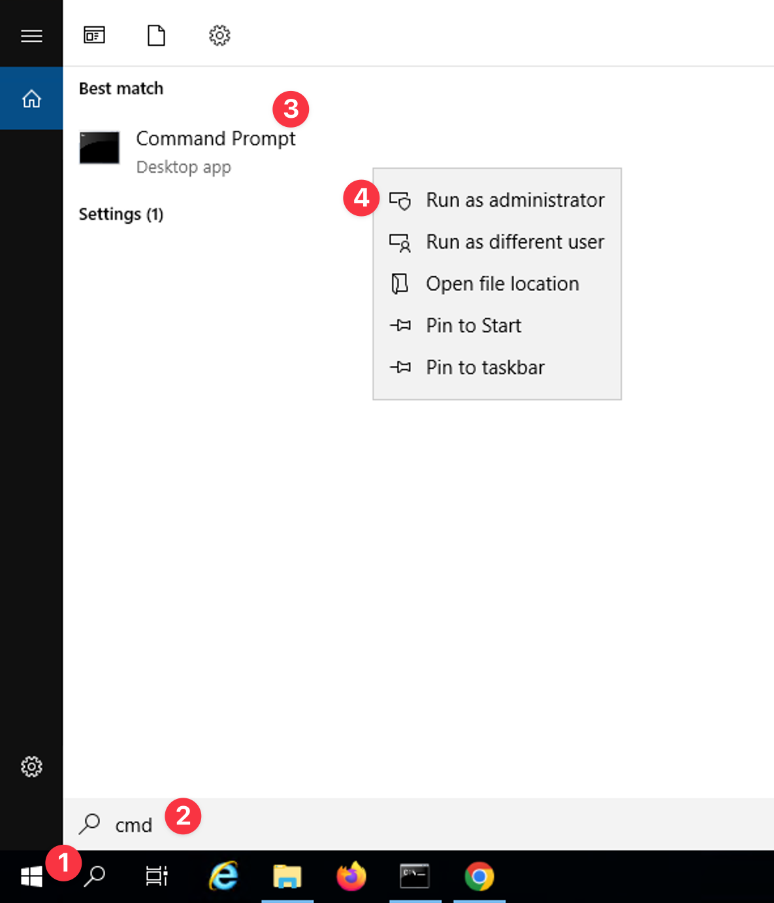

    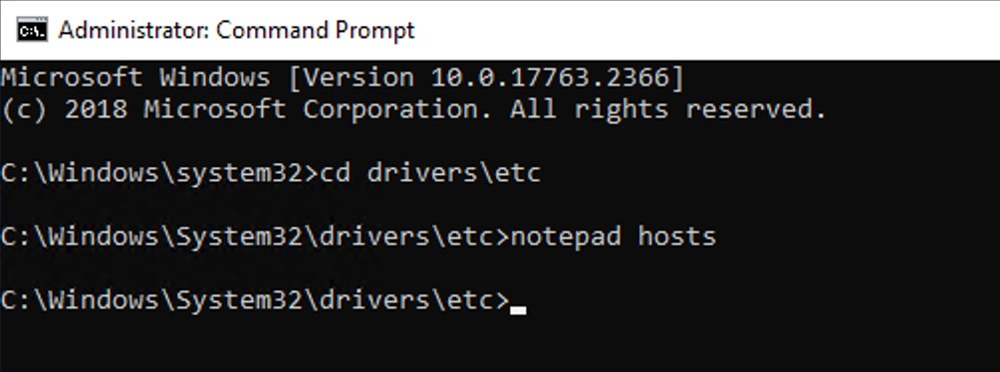

    add example.com domain:

    ```
    10.1.1.9 www.example.com example.com
    ```

    Save the file.

12. Test the configuration in *Chrome* by entering the below Load balancer **FQDN**.

    ```
    http://example.com
    ```

    or use `curl` in <kbd>cmd</kbd>:

    ```
    curl example.com
    ```

13. Keep on refreshing the page, you should observe the default weighted round robin behavior. You should see **server1**, **server2** and **server3** as below:

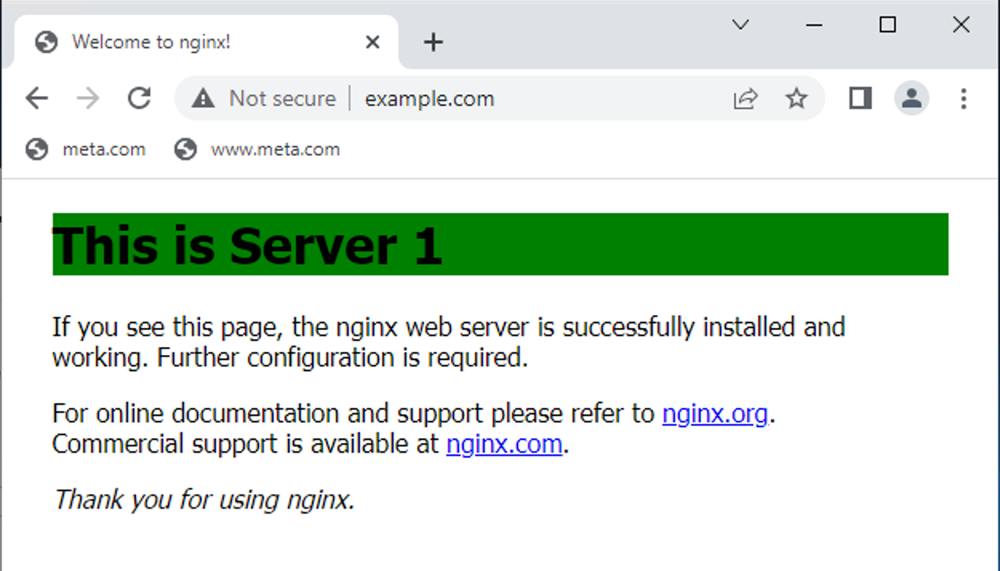

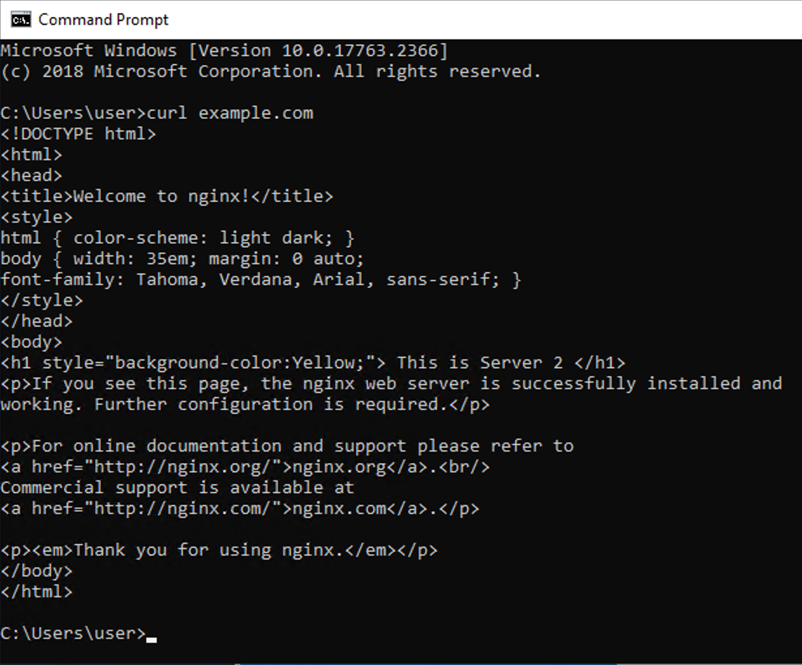


## 1.2 HTTPs Load Balancing

1. Use `openssl` to generate a self-signed certificate and key:

   ```bash
   sudo openssl req -x509 -nodes -days 365 -newkey rsa:4096 \
     -keyout /etc/ssl/nginx/nginx1.key -out /etc/ssl/nginx/nginx1.crt
   ```

2. Enter the values requested by openssl for ssl. For **FQDN** enter: 

   ```
   www.example.com
   ```

3. Create a new file called **https.conf**:

   ```bash
   sudo vi /etc/nginx/conf.d/https.conf
   ```

4. Add the below configuration to it:

   ```nginx
   # www.example.com HTTP Only Redirect
   server {
   	listen 80;
   	server_name www.example.com;
     
   	return 301 https://$host$request_uri;
   }
   
   # www.example.com HTTPS
   server {
   	listen 443 ssl default_server;
   	server_name www.example.com;
     
   	# Minimum SSL Configuration
   	ssl_certificate /etc/ssl/nginx/nginx1.crt;
   	ssl_certificate_key /etc/ssl/nginx/nginx1.key;
     
   	location / {
   		proxy_pass http://myServers;
   	}
   }
   ```

5. Save and reload NGINX:

   ```bash
   sudo nginx -s reload
   ```

   > In the first server context, HTTP will be redirected to HTTPs. 
   >
   > In the second server context, HTTPs will be processed.
   >
   > HTTPs requests will be proxied to myServers upstream, which has already been created and used for example.com load balancing.

6. Test the configuration in *Chrome* by entering the below Load balancer FQDN.

   ```
   http://www.example.com/
   ```

   > You should be redirected to https://www.example.com and then load balanced to one of the web servers.

7. Test the configuration in *Chrome* by entering the below Load balancer FQDN.

   ```
   https://www.example.com/
   ```

8. Keep on refreshing the page, you should observe the **default weighted round robin behavior**. You should see **Server 1**, **Server 2** and **Server 3** as below:

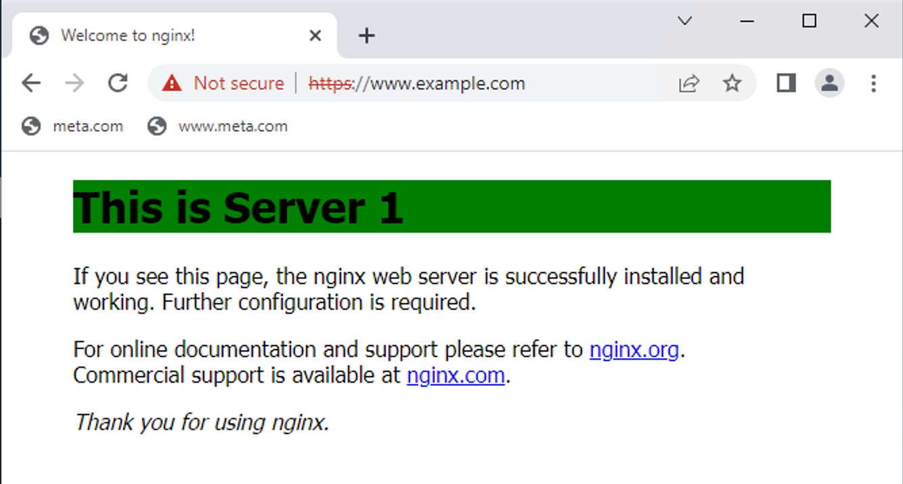

You are done with the lab!


9. Optionally, if you want to test changing the deault (round robin) load balancing to (least connections LB), you can do that by adding `least_conn;` under the upstream as below:

   ```bash
   sudo vi /etc/nginx/conf.d/main.conf
   ```

   Edit configuration to:

   ```nginx
   upstream myServers {
     least_conn;
     zone http_backend 64k;
     server 10.1.1.10:8080;
     server 10.1.1.11:8080;
     server 10.1.1.12:8080;
   }
   ```

10. Save and reload NGINX:

    ```bash
    sudo nginx -s reload
    ```

11. Test the configuration in *Chrome* by entering the below Load balancer FQDN:

    ```
    https://www.example.com/
    ```

    

# LAB 2: API & Dashboard Activity Monitoring 

 Learning Objectives:

 By the end of the lab you will be able to:

- Configuring API & dashboard
- Dashboard activity monitoring
- Changing upstream status

 

## 2.1 API & Dashboard

1. Open the **main.conf** file:

   ```bash
   sudo vi /etc/nginx/conf.d/main.conf
   ```

2. In **main.conf** create a new location `/api` in the `example.com` `server {}` block:

   ```nginx
   location /api {
   	api write=on;
   }
   ```

   > Note: This allows you to write to the NGINX (back ends) configuration using the NGINX API.

3. Add a second prefix: `/dashboard` along with a [try_files](http://nginx.org/en/docs/http/ngx_http_core_module.html#try_files) directive that will return **dashboard.html**:

   ```nginx
   location /dashboard {
   	try_files $uri $uri.html /dashboard.html;
   }
   ```

4. Your file should look like the below:

   ```nginx
   upstream myServers {
     	least_conn;
       zone http_backend 64k;
       server 10.1.1.10:8080;
       server 10.1.1.11:8080;
       server 10.1.1.12:8080;
   }
   
   server {
   	listen 80;
   	server_name example.com;
   	root /usr/share/nginx/html;
   
     error_log /var/log/nginx/myServers.error.log info;
     access_log /var/log/nginx/myServers.access.log combined;
   
   	location / {
    		proxy_pass http://myServers;
   	}
     location /api {
     	api write=on;
     }
   	location /dashboard {
     	try_files $uri $uri.html /dashboard.html;
   	}
   }
   
   # www.example.com HTTP Only Redirect
   ...
   ```

5. Save, reload NGINX:

   ```bash
   sudo nginx -s reload 
   ```

6. Test NGINX dashboard:

   ```
   http://example.com/dashboard
   ```

   You should see the **NGINX+ dashboard** which shows current connections:

   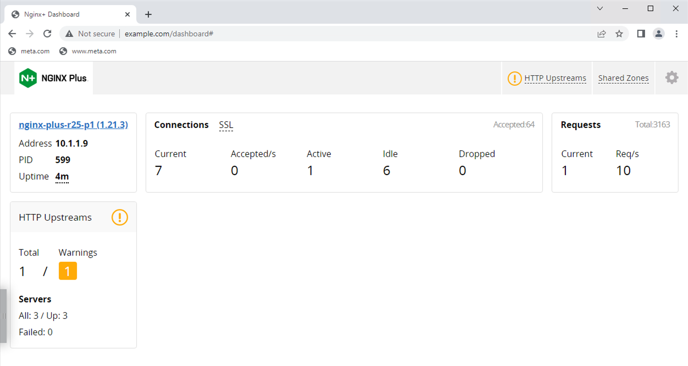

7. Click the **HTTP Upstreams** tab to view the status of the backend servers: 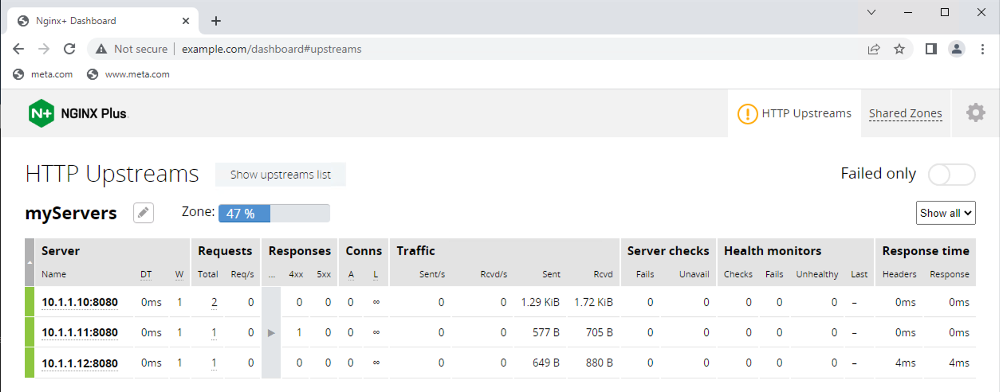

8. Click the **Shared Zones** tab to view the status of the memory zone activity:

   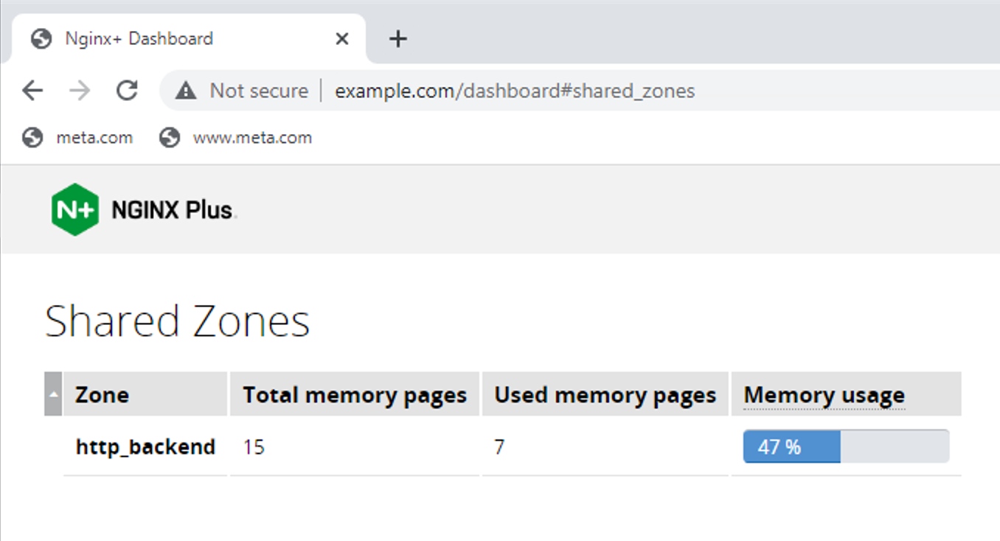

9. Click back the **HTTP Upstream** tab. Now let us test upstream backup.

10. Open the **main.conf** file:

    ```bash
    sudo vi /etc/nginx/conf.d/main.conf
    ```

11. Mark the third server as **backup**:

    ```nginx
    10.1.1.12:8080 backup;
    ```

12. Set up a **health check** that will fail the first primary server. Add a match block in the http context (top of your file) that regards the text “Server-1” as unhealthy:

    ```nginx
    match health_primary {
    	body !~ "Server 1";
    }
    ```

13. Add the `health_check` match statement to location / block under the **proxy_pass** statement:

    ```nginx
    ...
    proxy_pass http://myServers;
    health_check match=health_primary fails=2;
    ...
    ```

14. Your file should look like the below:

    ```nginx
    match health_primary {
    	body !~ "Server 1";
    }
    
    upstream myServers {
      least_conn;
    	zone http_backend 64k;
      server 10.1.1.10:8080;
      server 10.1.1.11:8080;
      server 10.1.1.12:8080 backup;
    }
    
    server {
      listen 80;
      server_name example.com;
      root /usr/share/nginx/html;
    
      error_log /var/log/nginx/myServers.error.log info;
      access_log /var/log/nginx/myServers.access.log combined;
    
    	location / {
        proxy_pass http://myServers;
        health_check match=health_primary fails=2;
      }
      location /api {
        api write=on;
      }
      location /dashboard {
        try_files $uri $uri.html /dashboard.html;
      }
    }
    
    # www.example.com HTTP Only Redirect
    ...
    ```

15. Exit and save the file. Reload NGINX:

    ```bash
    sudo nginx -s reload
    ```

16. Test load balancing in *Chrome* browser:

    ```
    http://example.com/
    ```

17. Open another *Chrome* tab and go to **NGINX dashboard**. Click on the **HTTP upstream** tab as follows:

    ```
    http://example.com/dashboard
    ```

     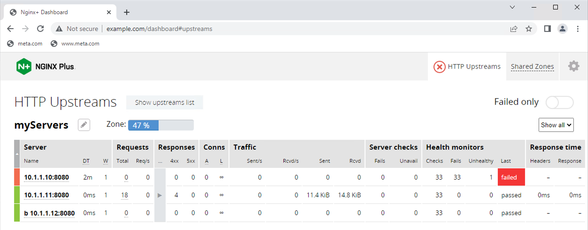

    

    You should only be load balanced to **Server 2 (10.1.1.11:8080)**. Why?

    - Because **10.1.1.10** is down.
    - **10.1.1.12** is configured as backup. Notice the small **“b”** next to **10.1.1.12**.

18. Edit **main.conf** file again. Mark the 2nd primary server as **down**:

    ```bash
    sudo vi /etc/nginx/conf.d/main.conf
    ```

    ```
    10.1.1.11:8080 down;
    ```

19. Save the file and reload NGINX:

    ```bash
    sudo nginx -s reload
    ```

20. Test load balancing in your *Chrome* browser. Watch NGINX dashboard. What is the result?

    ```
    http://example.com/
    ```

    You should only be load balanced to **Server 3 (10.1.1.12:8080)** -> the backup Server as below:

    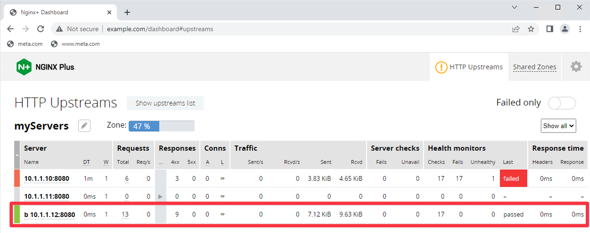 

21. Remove “down” and “backup” from myServers upstream for the next labs as follows:

    ```nginx
    upstream myServers {
        zone http_backend 64k;
        server 10.1.1.10:8080;
        server 10.1.1.11:8080;
        server 10.1.1.12:8080;
    }
    ```

    Also comment out the **health_check** command as follows:

    ```nginx
    # health_check match=health_primary fails=2;
    ```

22. Save the file and reload NGINX:

    ```
    sudo nginx -s reload
    ```

     

# LAB 3: Session Persistence

 Learning Objectives:

 By the end of the lab you will be able to:

- Configuring sticky cookie persistence

- TCP load balancing
- TCP health check

 

## 3.1 Sticky Cookie Session Persistence

1. Open the **main.conf** file:

   ```bash
   sudo vi /etc/nginx/conf.d/main.conf
   ```

2. Enable sticky cookie with an expiration of 1 hour:

   ```nginx
   upstream myServers {
     least_conn;
     zone http_backend 64k;
     server 10.1.1.10:8080;
     server 10.1.1.11:8080;
     server 10.1.1.12:8080;
     sticky cookie my_cookie expires=1h;
   }
   
   
   ```

3. Save the file and reload NGINX:

   ```bash
   sudo nginx -s reload
   ```

4. Test session persistence in *Chrome* by going to the below URL:

   ```
   http://example.com/
   ```

5. Keep on refreshing the page. You should see the same backend server all the time.

6. Now open developer tools in *Chrome*. Click the 3 dots in the upper right corner.

   **Choose More Tools > Developer tools**.

7. Choose the **Application tab**, and then click the arrow next to **Cookies** on the left hand side to expand the view. Click the Load balancer URL below **Cookies**. You should see the hash value of your cookie under **value** heading as below:

   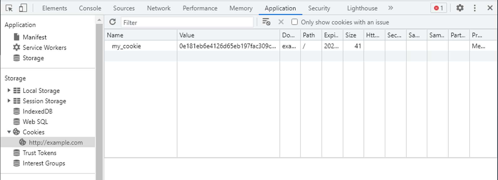

8. Remove session persistence by commenting out the sticky cookie directive:

   ```bash
   sudo vi /etc/nginx/conf.d/main.conf
   ```

   ```nginx
   # sticky cookie my_cookie expires=1h;
   ```

9. Save the file and reload NGINX:

   ```bash
   sudo nginx -s reload
   ```

10. Test accessing http://example.com. Keep on refreshing. You should see load balancing between the 3 web servers. 

 

## 3.2 TCP Load balancing

1. Open the **global nginx configuration** file (**/etc/nginx/nginx.conf**):

   ```bash
   sudo vi /etc/nginx/nginx.conf
   ```

2. Add the following below the **http context**:

   ```nginx
   stream {
   	include /etc/nginx/tcp/*.conf;
   }
   ```

   > This tells NGINX to include any configuration file in the tcp directory in its configuration.

   Your file should look like the below:

   ```nginx
   user  nginx;
   worker_processes  auto;
   
   error_log  /var/log/nginx/error.log notice;
   pid        /var/run/nginx.pid;
   
   
   events {
     worker_connections  1024;
   }
   
   
   http {
     include       /etc/nginx/mime.types;
     default_type  application/octet-stream;
   
     log_format  main  '$remote_addr - $remote_user [$time_local] "$request" '
       '$status $body_bytes_sent "$http_referer" '
       '"$http_user_agent" "$http_x_forwarded_for"';
   
     access_log  /var/log/nginx/access.log  main;
   
     sendfile        on;
     #tcp_nopush     on;
   
     keepalive_timeout  65;
   
     #gzip  on;
     include /etc/nginx/conf.d/*.conf;
   }
   
   stream {
   	include /etc/nginx/tcp/*.conf;
   }
   ...
   ```

   

3. Save and reload the configuration:

   ```bash
   sudo nginx -s reload
   ```

4. Create a tcp directory. Then add the a new conf file called **tcp_lb.conf**:

   ```bash
   sudo mkdir -p /etc/nginx/tcp
   sudo vi /etc/nginx/tcp/tcp_lb.conf 
   ```

5. Create an upstream called **tcp_backend**, the following memory zone tcp_upstream 64k, and place the three web servers in your upstream:

   ```nginx
   upstream tcp_backend {
     zone tcp_upstream 64k;
     server 10.1.1.10:8080;
     server 10.1.1.11:8080;
     server 10.1.1.12:8080;
   }
   ```

6. Create a server that listens on port **8080** and proxies to upstream **tcp_backend**:

   ```nginx
   server {
     listen 8080;
     proxy_pass tcp_backend;
   }
   ```

   Your file needs to look like the below:

   ```nginx
   upstream tcp_backend {
     zone tcp_upstream 64k;
     server 10.1.1.10:8080;
     server 10.1.1.11:8080;
     server 10.1.1.12:8080;
   }
   
   server {
     listen 8080;
     proxy_pass tcp_backend;
   }
   ```

7. Save the file and reload NGINX:

   ```bash
   sudo nginx -s reload
   ```

8. View the **dashboard** and click on **TCP/UDP upstreams** tab:

   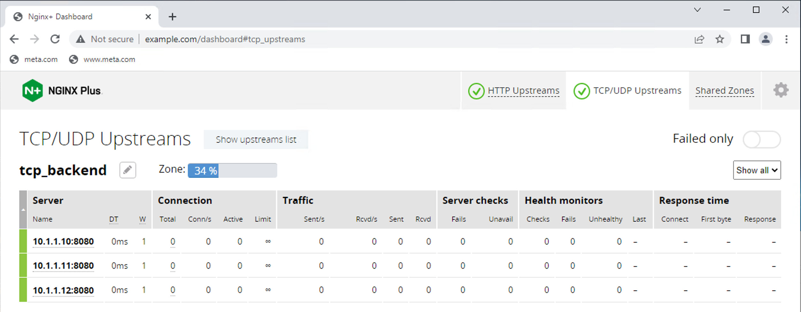

   You should see a new tab titled “TCP/UDP Upstreams”.

9. From the *Windows_Jump_Host* test  TCP load balancing by using the `telnet` command multiple times. Watch the dashbboard:

   ```bash
   telnet 10.1.1.9 8080
   ```

   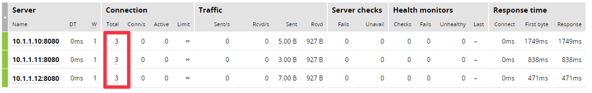You should see the connections load balanced between all 3 servers.

## 3.3 TCP Health Check

1. Open **tcp_lb.conf** configuration file:

   ```bash
   sudo vi /etc/nginx/tcp/tcp_lb.conf
   ```

2. Add a match block using **GET** request to confirm the TCP connection. Add the configuration at the top of the file:

   ```nginx
   match tcp {
   	send "GET / HTTP/1.0\r\nHost: localhost:8080\r\n\r\n";
     expect ~* "300";
   } 
   ```

3. Add a **health check** statement to the server block under the proxy_pass statement. This check sets up an interval of 10 seconds between health checks, sets failure to 1 and passes to 3. It also references the match block configured in step 2:

   ```nginx
   server {
     listen 8080;
     proxy_pass tcp_backend;
     health_check interval=10 passes=3 fails=1 match=tcp;
   }
   ```

   Your file should look like the below one:

   ```nginx
   match tcp {
     send "GET / HTTP/1.0\r\nHost: localhost:8080\r\n\r\n";
     expect ~* "300";
   }
   
   upstream tcp_backend {
     zone tcp_upstream 64k;
     server 10.1.1.10:8080;
     server 10.1.1.11:8080;
     server 10.1.1.12:8080;
   }
   
   server {
     listen 8080;
     proxy_pass tcp_backend;
     health_check interval=10 passes=3 fails=1 match=tcp;
   }
   ```

4. Save the file and reload NGINX:

   ```bash
   sudo nginx -s reload
   ```

5. This should cause your health check to fail.

   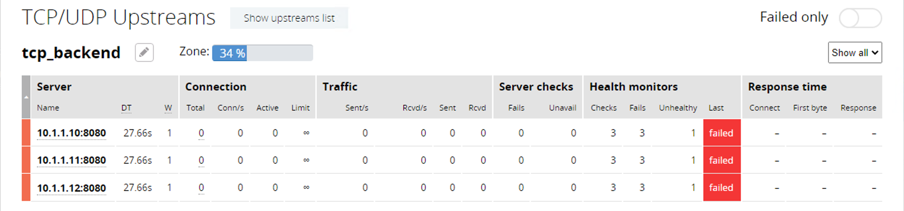

6. Open the **tcp_lb.conf** file:

   ```bash
   sudo vi /etc/nginx/tcp/tcp_lb.conf
   ```

7. Change 300 to 200 as follows:

   ```nginx
   match tcp {
     send "GET / HTTP/1.0\r\nHost: localhost:8080\r\n\r\n";
     expect ~* "200";
   }
   ```

8. Save the file and reload NGINX:

   ```bash
   sudo nginx -s reload
   ```

   This casuse the health check to pass:

   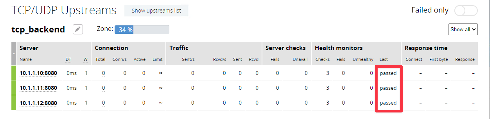


This concludes the Intermediate Lab.