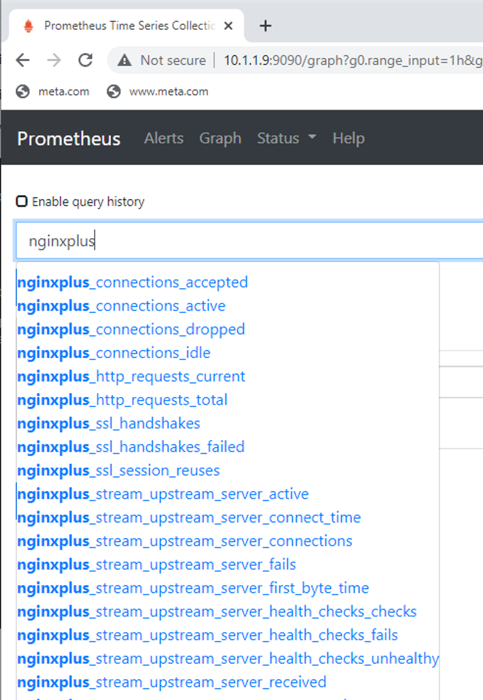

# Monitoring

A quick demo to see & feel the DevOps tools.


## LAB 1: Prometheus

1. Login to *N_Load_Balancer* using *SSH* and install **Prometheus**:

   ```bash
   sudo apt install -y prometheus
   systemctl status prometheus
   ```

2. Configure Prometheus:

   ```bash
   sudo vi /etc/prometheus/prometheus.yml
   ```

   add the following configuration to the end of the file:

   ```
     - job_name: nginx
       static_configs:
               - targets: ['localhost:9113']
   ```

   > localhost:9113 is where the nginx-prometheus-exporter listens by default

   Reload the Prometheus and check the status:

   ```bash
   sudo systemctl reload prometheus
   sudo systemctl status prometheus
   ```

   Press <kbd>q</kbd> to quit the listing.

3. Download and configure **nginx-prometheus-exporter**:

   ```bash
   sudo apt install -y prometheus-nginx-exporter
   ```

   Configure Prometheus:

   ```bash
   sudo vim /etc/default/prometheus-nginx-exporter
   ```

   modify the `ARGS=""` to the following:

   ```
   ARGS="-nginx.plus -nginx.scrape-uri=http://127.0.0.1:8081/api"
   ```

   > Here we are going to use NGINX+ stats and the URL from where to get the stats is: http://127.0.0.1:8081/api

   Reload prometheus-nginx-exporter and check the status:

   ```bash
   sudo systemctl restart prometheus-nginx-exporter
   sudo systemctl status prometheus-nginx-exporter
   ```

   Press <kbd>q</kbd> to quit the listing.

4. Configure dedicated listener for prometheus-nginx-exporter:

   ```bash
   sudo vi /etc/nginx/conf.d/stats.conf
   ```
   
   add the following configuration:
   
   ```nginx
   server {
   	listen 8081;
   	location /api {
   		api write=on;
   		allow 127.0.0.1;
   		deny all;
   	}
   	location /dashboard {
   		try_files $uri $uri.html /dashboard.html;
   		allow 127.0.0.1;
   		deny all;
   	}
   }
   ```

   Reload NGINX:

   ```bash
   sudo nginx -s reload
   ```

2. Install traffic generator and generate some load:

   ```bash
   sudo apt install -y hey
   
   hey -z 5m http://10.1.1.9/ &
   hey -z 5m https://10.1.1.9/
   ```

3. See the results in Prometheus.

   Use Chrome to visit:

   ```
   http://10.1.1.9:9090/
   ```

   Then click Graph in the menu and Grpah under the Execute command:
   
   
   
   In the Expression.. field, start typing: `nginxplus_`
   
   
   
   Choose some of those metrics and click Execute.
   
   
   
   You can test and play with more complex queries:
   
   ```
   # basic metric
   nginxplus_http_requests_total
   # the same metric in time
   sum(increase(nginxplus_http_requests_total[1m]))
   
   # total number of connections
   nginxplus_connections_accepted
   # number of connections in 1m segment
   rate(nginxplus_connections_accepted[1m])
   ```
   
   Modify the NGINX config:
   
   ```bash
   sudo vim /etc/nginx/conf.d/main.conf
   ```
   
   add weight options:
   
   ```nginx
   upstream myServers {
       zone http_backend 64k;
       server 10.1.1.10:8080 weight=1;
       server 10.1.1.11:8080 weight=2;
       server 10.1.1.12:8080 weight=3;
       sticky cookie my_cookie expires=1h;
   }
   ```
   
   Reload NGINX:
   
   ```bash
   sudo nginx -s reload
   ```
   
   Generate some more load:
   
   ```bash
   hey -z 5m https://10.1.1.9/
   ```
   
   use this query:
   
   ```
   # all the requests
   nginxplus_upstream_server_requests
   # per server in time
   sum(rate(nginxplus_upstream_server_requests[1m])) by (server)
   ```
   
   Check Prometheus:
   
   
   
   > You can find lot of examples online.


# LAB 2: Grafana


1. Install Grafana:

   ```bash
   cd /home/ubuntu
   sudo apt-get install -y adduser libfontconfig1
   wget https://dl.grafana.com/enterprise/release/grafana-enterprise_8.5.5_amd64.deb
   sudo dpkg -i grafana-enterprise_8.5.5_amd64.deb
   sudo systemctl daemon-reload
   sudo systemctl start grafana-server
   ```

2. Use Jumphost and *Chrome* to see **Grafana Dashboard**:

   ```
   http://10.1.1.9:3000/
   ```

3. Add Prometheus as **Data Source**:

   

   

   Add Prometheus Name and URL:

   ```
   Prometheus (or whatever you like)
   http://localhost:9090
   ```

   

   > You can play with Prometheus data in Graphana the same way like in the Prometheus UI.

4. Add some NGINX Dashboard:

   Click *Browse* then *Import*:

   

   Open in Chrome:

   ```
   https://raw.githubusercontent.com/erkac/training-nginx-02H/master/grafana-nginx-plus.json
   ```

   Copy the Content of JSON to *Import via panel json* and Click *Load*.

   Choose the *Data Source* -> *Prometheus* and *Import*:

   

   Generate some load to see the reports.

   You can also Add (1) or Modify (2) existing Panels:

   

